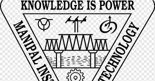
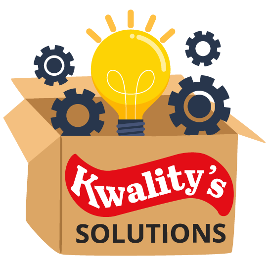
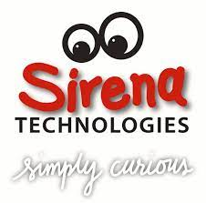
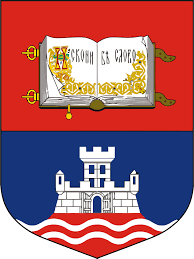

I love technology, music and sports. I aspire to be an entrepreneur in the field of Industrial Automation. My field of interest is Localization and Planning. 

# My Education
<<<<<<< HEAD

=======
>>>>>>> 05ef6a7f9571d7b176f93ca94719827849d73a16
**Master of Engineering (MEng) in Robotics, [University of Maryland](https://www.umd.edu/)**
#### August 2021 - Present | Maryland, USA
<strong>coursework:</strong>
* <strong>Fall '21: </strong>Control Systems for Robtics, Introduction to Robot modelling, Software Development for Robotics  

<<<<<<< HEAD
-----

=======
====== 
>>>>>>> 05ef6a7f9571d7b176f93ca94719827849d73a16

**Bachelor of Technology (B.Tech) in Electronics and Communications (Minor: SIgnal Processing), [Manipal Institute of Technology](https://manipal.edu/mit.html)**
#### August 2014 - May 2018 | Manipal, India
<strong>CGPA:</strong> 3.7/4.0  

# Work Experience
-----

Kwality's Solutions 
**CEO / Founder**
#### Feb 2020 - Present | Bangalore, India 

<<<<<<< HEAD
-----

=======
====== 
>>>>>>> 05ef6a7f9571d7b176f93ca94719827849d73a16
Sirena Technologies 
**Research Engineer** 
**Trainee Software Engineer**
#### Dec 2017 - Feb 2020 | Bangalore, India 

====== 

-----

University of Belgrade 
**Summer Intern**
#### June 2017 - July 2017 | Belgrade, Serbia 

# Key Skills
* <strong> Programming Languages: </strong> Python, C++, Matlab, Verilog, Java  
* <strong> Operating Systems: </strong> Windows, Linux (Ubuntu)  
* <strong> Libraries: </strong> Numpy, Pandas, Eigen, Matplotlib, Scikit-learn, OpenCV  
* <strong> Tools: </strong> ROS, Gazebo, Simulink, LabView  
